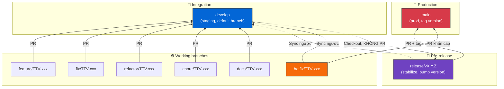
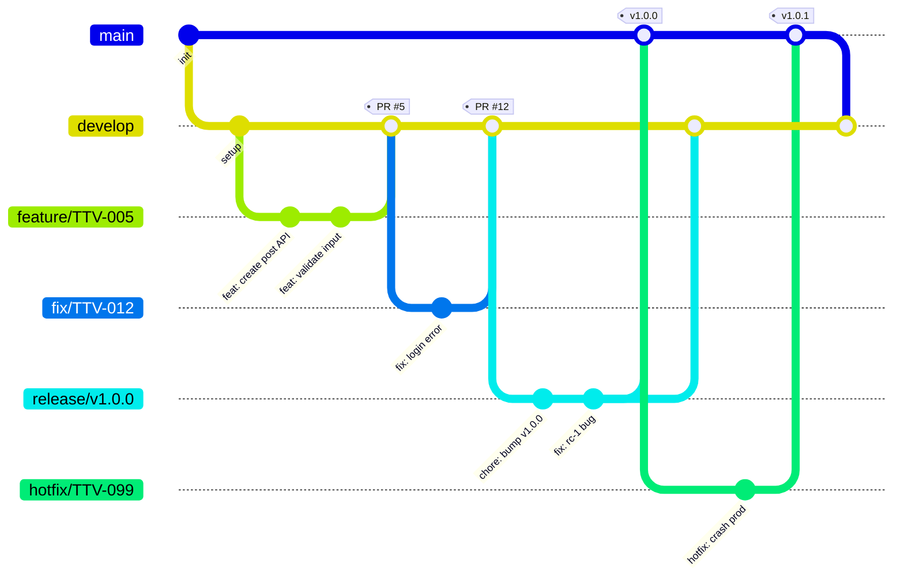

# Git Workflow

## Mục lục

- [Git Workflow](#git-workflow)
  - [Mục lục](#mục-lục)
  - [GitHub Project Board](#github-project-board)
  - [Issue Template](#issue-template)
    - [Bug](#bug)
    - [Feature](#feature)
    - [Task](#task)
  - [Cấu trúc nhánh](#cấu-trúc-nhánh)
    - [Sơ đồ tổng quan](#sơ-đồ-tổng-quan)
    - [Git history visualization](#git-history-visualization)
  - [Quy ước Issue ID](#quy-ước-issue-id)
  - [Quy ước Branch](#quy-ước-branch)
  - [Quy ước Commit](#quy-ước-commit)
  - [Quy ước Pull Request](#quy-ước-pull-request)
  - [Quy trình làm việc](#quy-trình-làm-việc)
    - [Bước 1: Tạo issue](#bước-1-tạo-issue)
    - [Bước 2: Chuyển Ready](#bước-2-chuyển-ready)
    - [Bước 3: Bắt đầu làm](#bước-3-bắt-đầu-làm)
    - [Bước 4: Code + commit](#bước-4-code--commit)
    - [Bước 5: Tạo Pull Request](#bước-5-tạo-pull-request)
    - [Bước 6: Review + Test](#bước-6-review--test)
    - [Bước 7: Merge](#bước-7-merge)
  - [Release flow](#release-flow)
  - [Hotfix flow](#hotfix-flow)
  - [Yêu cầu trước khi merge](#yêu-cầu-trước-khi-merge)

## GitHub Project Board

Các columns:

- Backlog
- Ready
- In Progress
- In Review
- Testing
- Done

Rule:

- Issue mới (có thể đã assign) → Backlog
- Sẵn sàng làm + đã assign → Ready
- Đang làm → In Progress
- Mở PR → In Review
- Test → Testing
- Merge xong → Done


## Issue Template

### Bug

```markdown
Title: [BUG] Login fails with valid credentials

## Description

- Mô tả lỗi rõ ràng

## Steps to Reproduce

1. Navigate to /login
2. Enter valid credentials
3. Click submit

## Expected

- Đăng nhập thành công, redirect về dashboard

## Actual

- Hiển thị lỗi 500, không đăng nhập được

## Environment

- Browser/OS: Chrome 120 / Windows 11
- API version: v1.2.0
- Env: Staging / Production
```

### Feature

```markdown
Title: [FEATURE] Add post scheduling

## Description

- Admin có thể lên lịch đăng bài viết

## Acceptance Criteria

- [ ] Admin chọn ngày giờ đăng
- [ ] Post tự động publish đúng lịch
- [ ] Có thể hủy lịch trước khi publish

## Impact

- API: Có / Không — chi tiết nếu Có
- UI: Có / Không — chi tiết nếu Có
- DB: Có / Không — chi tiết nếu Có
```

### Task

```markdown
Title: [TASK] Refactor auth middleware

Description:

- Mô tả

Notes:

- Dependency
```

## Cấu trúc nhánh

Team áp dụng mô hình Git Flow rút gọn:

### Sơ đồ tổng quan



### Git history visualization



Quy tắc:

- **Default branch = `develop`** (để issue auto-close khi merge PR working branch)
- `main` được protect: chỉ accept PR từ `release/*` hoặc `hotfix/*`
- `develop` được protect: chỉ accept PR từ `feature/*`, `fix/*`, `refactor/*`, `chore/*`, `docs/*`, `test/*`, `ci/*`, và sync từ `release/*`, `main`
- Mọi working branch checkout từ `develop` (trừ `hotfix/*` checkout từ `main`)
- `release/vX.Y.Z`:
  - Checkout từ `develop` khi đủ feature cho release
  - Chỉ accept commit: bump version, fix bug RC, update docs (KHÔNG thêm feature mới)
  - Merge vào `main` + tag version → đồng thời merge ngược về `develop`
  - Format tên: `release/v1.0.0`, `release/v1.2.3`...
- `hotfix/TTV-xxx`: checkout từ `main` → merge vào `main` + tag → merge ngược về `develop`

## Quy ước Issue ID

Team dùng song song 2 loại ID:

- **`TTV-xxx`**: ID dùng cho **tên branch** (ví dụ: `feature/TTV-005`). `xxx` là số thứ tự issue trong project, có padding 3 chữ số.
- **`#xxx`**: ID GitHub issue number (auto-increment), dùng trong **commit message** và **PR title/body** để GitHub tự link và auto-close.

→ Cả 2 ID **trỏ về cùng 1 issue**, chỉ khác format theo ngữ cảnh sử dụng.

Ví dụ: issue có Project ID `TTV-005` và GitHub number `#5`:

- Branch: `feature/TTV-005`
- Commit: `feat: add create post API (#5)`
- PR title: `[Feature] Create post API (#5)`
- PR body: `Closes #5`

## Quy ước Branch

Format: `type/TTV-issueId`

Ví dụ:

- `feature/TTV-005`
- `fix/TTV-012`
- `chore/TTV-078`

Các type:

- feature
- fix
- hotfix
- release (format đặc biệt: `release/vX.Y.Z`, không có issueId)
- refactor
- chore
- docs
- test
- ci

## Quy ước Commit

Format: `type: nội dung [(#issueId)]`

Phần `(#issueId)` là optional — chỉ thêm khi commit liên quan trực tiếp đến 1 issue.

Ví dụ:

- `feat: add create post API (#5)`
- `fix: handle null user profile`
- `refactor: optimize query post list`
- `wip: draft create post UI` — dùng `wip:` cho commit chưa hoàn chỉnh, sẽ squash khi merge

Các type tương tự với Quy ước Branch (dùng dạng viết tắt: `feat`, `fix`, `chore`, `docs`, `refactor`, `test`, `ci`).

## Quy ước Pull Request

PR title:

- Format: `[type] mô tả ngắn (#issueId)`

Ví dụ:

- `[Feature] Create post API (#45)`
- `[Fix] Login error when token expired (#12)`
- `[Refactor] Optimize post query (#78)`
- `[Hotfix] Fix crash production (#99)`

Các type tương tự với Quy ước branch

PR description template:

```markdown
## What

- Tạo API create post

## Why

- Phục vụ CMS admin

## Changes

- Add POST /posts
- Validate input

## Test

- Postman OK

Closes #45
```

## Quy trình làm việc

### Bước 1: Tạo issue

- Tạo issue rồi add vào github project hoặc tạo trực tiếp
- Assign người phụ trách (nếu có)
- Issue có status Backlog
- Có thể tạo các sub issue nếu issue quá lớn

### Bước 2: Chuyển Ready

- Khi đã assign người phụ trách, chuyển status issue sang Ready

### Bước 3: Bắt đầu làm

- Pull latest:
  - `develop` cho `feature/*`, `fix/*`, `refactor/*`, `chore/*`, `docs/*`, `test/*`, `ci/*`, `release/*`
  - `main` cho `hotfix/*`
- Checkout sang branch mới theo quy ước branch
- Chuyển trạng thái issue sang In Progress

### Bước 4: Code + commit

- Commit nhỏ, rõ đúng theo quy ước commit
- Commit có thể kèm ref đến sub-issue / issue

Ví dụ: `feat: add create post API (#5)`

### Bước 5: Tạo Pull Request

- Tạo PR theo quy ước PR
- Base branch:
  - `develop` cho mọi working branch thường
  - `main` cho `release/*` và `hotfix/*`
- Gắn ref issue như trong quy ước PR

### Bước 6: Review + Test

- Đảm bảo CI pass (xem [Yêu cầu trước khi merge](#yêu-cầu-trước-khi-merge))
- Reviewer review code
- Nếu Request Changes → fix + push lại
- Chuyển issue sang Testing

### Bước 7: Merge

- Merge strategy:
  - **Squash merge** với working branch → `develop` (giữ history `develop` sạch)
  - **Merge commit** (không squash) với `release/*` → `main` và `hotfix/*` → `main` (giữ full history release)
- Issue tự close (nhờ `Closes #issueId`, do `develop` là default branch)

## Release flow

Áp dụng định kỳ khi `develop` đủ feature để release production.

> ⚠️ **KHÔNG bao giờ tạo PR trực tiếp từ `develop` → `main`.** Mọi release đều phải đi qua nhánh trung gian `release/vX.Y.Z` để stabilize và bump version trước.

1. Checkout nhánh release từ `develop`:
   ```bash
   git checkout develop && git pull
   git checkout -b release/v1.0.0
   git push -u origin release/v1.0.0
   ```
2. Trên nhánh `release/vX.Y.Z`: bump version, update CHANGELOG, fix bug RC (nếu có).
   - **KHÔNG** thêm feature mới trên nhánh này.
3. Tạo PR `release/vX.Y.Z` → `main`:
   - Title: `[Release] vX.Y.Z`
   - Merge commit (không squash) để giữ history
4. Sau khi merge vào `main`, tag version:
   ```bash
   git checkout main && git pull
   git tag v1.0.0 && git push --tags
   ```
5. Tạo PR `release/vX.Y.Z` → `develop` để sync các fix RC ngược lại develop.
6. Deploy production từ `main`.
7. Xóa nhánh `release/vX.Y.Z` sau khi cả 2 PR merge xong.

## Hotfix flow

Áp dụng khi production có bug nghiêm trọng cần fix khẩn cấp, không thể chờ release thường.

1. Checkout `hotfix/TTV-XXX` từ `main`:
   ```bash
   git checkout main && git pull
   git checkout -b hotfix/TTV-099
   ```
2. Fix bug + commit theo quy ước.
3. Tạo PR `hotfix/TTV-XXX` → `main`:
   - Title: `[Hotfix] mô tả ngắn (#issueId)`
   - Merge commit (không squash)
4. Sau khi merge `main`: tag version patch mới (vd `v1.0.1`).
   ```bash
   git tag v1.0.1 && git push --tags
   ```
5. Tạo PR `hotfix/TTV-XXX` → `develop` để sync fix về develop.
6. Deploy production từ `main`.
7. Xóa nhánh `hotfix/TTV-XXX`.

## Yêu cầu trước khi merge

PR chỉ được merge khi đáp ứng đủ các điều kiện:

- ✅ **CI pass**: tất cả workflow (build, lint, test) phải xanh
- ✅ **Approvals**: ít nhất **1 reviewer approve** (PR critical/release/hotfix nên cần ≥ 2)
- ✅ **Conflict resolved**: không còn merge conflict với base branch
- ✅ **Comment resolved**: tất cả comment review đã được resolve
- ✅ **Branch up-to-date**: rebase/merge base branch mới nhất nếu PR đã cũ

Khi PR conflict:

```bash
git checkout your-branch
git fetch origin
git rebase origin/develop   # hoặc origin/main nếu base là main
# resolve conflict thủ công
git add .
git rebase --continue
git push --force-with-lease
```

→ Ưu tiên `--force-with-lease` thay vì `--force` để tránh ghi đè commit của người khác.
