# 🍲 PizzaChaoNgon POS — Implementation Plan

## Tổng quan dự án

**PizzaChaoNgon (NutriPOS)** — Hệ thống POS quản lý cửa hàng cháo dinh dưỡng.

| Layer | Tech Stack |
|-------|-----------|
| **Backend** | Spring Boot 4.1, Java 21, Spring Security OAuth2 Resource Server, JPA/Hibernate, MySQL |
| **Frontend** | Vite 8, React 19, TypeScript 6, **Shadcn/UI**, **Recharts** |
| **Database** | MySQL — 18 bảng (MVP schema) |

### Quyết định kỹ thuật

| Hạng mục | Quyết định |
|----------|-----------|
| UI Library | **Shadcn/UI** (+ Tailwind CSS + Radix UI) |
| Chart Library | **Recharts** (React-native, nhẹ, tương thích tốt Shadcn) |
| Auth | **Spring Security OAuth2 Resource Server** (JWT) |
| Realtime | **Không cần** — Staff tạo đơn xong, đơn hiện trong danh sách chờ, làm xong thì ấn thanh toán |

### Luồng bán hàng chính
```
Mở ca → Tạo đơn (đơn vào danh sách chờ) → Làm món theo thứ tự → Ấn thanh toán (mặt/CK) → Đóng ca
```

### Vai trò hệ thống
| Role | Mô tả |
|------|-------|
| `OWNER` | Quản lý toàn bộ: doanh thu, nhân viên, món, chi phí, báo cáo |
| `STAFF` | Tạo đơn, thanh toán, mở/đóng ca, ghi chi phí |

### Quy tắc thực thi
> [!IMPORTANT]
> Thực hiện **tuần tự** Phase 1 → 6. Sau mỗi phase **PHẢI DỪNG** để user kiểm tra và cho phép mới tiếp tục phase sau.

---

## Phase Overview

```mermaid
gantt
    title PizzaChaoNgon — 6 Phases
    dateFormat  X
    axisFormat %s

    section Phase 1
    Foundation + Auth           :p1, 0, 5
    section Phase 2
    Menu + Product Management   :p2, 5, 9
    section Phase 3
    Shift + POS + Payment       :p3, 9, 15
    section Phase 4
    Queue + Cancel/Refund       :p4, 15, 19
    section Phase 5
    Expense + Inventory + Log   :p5, 19, 23
    section Phase 6
    Dashboard + Reports         :p6, 23, 27
```



---

## PHASE 1 — Foundation & Authentication

> **Mục tiêu**: Setup project chuẩn, database, auth hoạt động end-to-end

### Backend Tasks

| # | Task | Chi tiết |
|---|------|---------|
| 1.1 | Project structure | Packages: `config`, `entity`, `repository`, `service`, `controller`, `dto`, `exception`, `security`, `enums` |
| 1.2 | MySQL + JPA config | `application.yml`, datasource, hibernate ddl-auto |
| 1.3 | Base entity | `BaseEntity` (id, createdAt, updatedAt) với `@MappedSuperclass` |
| 1.4 | Enums | `UserRole` (OWNER, STAFF), `UserStatus` (ACTIVE, INACTIVE) |
| 1.5 | Entity `User` | Mapping bảng `users` |
| 1.6 | Spring Security + JWT | OAuth2 Resource Server config, JWT encoder/decoder, token service |
| 1.7 | Auth endpoints | `POST /auth/login`, `GET /auth/me`, `POST /auth/logout`, `POST /auth/change-password` |
| 1.8 | User CRUD | `GET/POST /users`, `GET/PUT /users/{id}`, `PATCH /users/{id}/status`, `POST /users/{id}/reset-password` |
| 1.9 | Exception handling | GlobalExceptionHandler + `ApiResponse<T>` wrapper |
| 1.10 | CORS | Cho phép frontend `localhost:5173` |
| 1.11 | Seed data | Tạo tài khoản OWNER mặc định khi khởi chạy |

### Frontend Tasks

| # | Task | Chi tiết |
|---|------|---------|
| 1.12 | Install deps | `shadcn/ui`, `tailwindcss`, `react-router-dom`, `axios`, `zustand`, `@tanstack/react-query`, `lucide-react` |
| 1.13 | Shadcn/UI init | `npx shadcn@latest init`, cấu hình theme dark POS-friendly |
| 1.14 | Design system | CSS variables, color palette, typography (Inter font) |
| 1.15 | Routing | `/login`, `/dashboard`, `/admin/users` — Protected routes |
| 1.16 | Auth layer | Zustand auth store + Axios interceptor (attach JWT, handle 401) |
| 1.17 | Login page | Username + password form, Shadcn `Card`, `Input`, `Button` |
| 1.18 | App Layout | Sidebar (collapsible) + Header (user info, logout) + Main content area |
| 1.19 | User management | Data table (Shadcn) + Create/Edit dialog + Status toggle |

### API Endpoints — Phase 1

| Method | Endpoint | Auth | Mô tả |
|--------|----------|------|-------|
| POST | `/api/v1/auth/login` | Public | Đăng nhập |
| GET | `/api/v1/auth/me` | All | Lấy user hiện tại |
| POST | `/api/v1/auth/logout` | All | Đăng xuất |
| POST | `/api/v1/auth/change-password` | All | Đổi mật khẩu |
| GET | `/api/v1/users` | OWNER | Danh sách nhân viên |
| POST | `/api/v1/users` | OWNER | Tạo nhân viên |
| GET | `/api/v1/users/{id}` | OWNER | Chi tiết nhân viên |
| PUT | `/api/v1/users/{id}` | OWNER | Cập nhật nhân viên |
| PATCH | `/api/v1/users/{id}/status` | OWNER | Khóa/mở tài khoản |
| POST | `/api/v1/users/{id}/reset-password` | OWNER | Reset mật khẩu |

### DB Table — Phase 1

```sql
-- users
CREATE TABLE users (
  id            BIGINT AUTO_INCREMENT PRIMARY KEY,
  username      VARCHAR(100) NOT NULL UNIQUE,
  password_hash VARCHAR(255) NOT NULL,
  full_name     VARCHAR(150) NOT NULL,
  phone         VARCHAR(20),
  role          VARCHAR(20) NOT NULL,  -- OWNER, STAFF
  status        VARCHAR(20) NOT NULL DEFAULT 'ACTIVE',  -- ACTIVE, INACTIVE
  created_at    DATETIME NOT NULL DEFAULT CURRENT_TIMESTAMP,
  updated_at    DATETIME NOT NULL DEFAULT CURRENT_TIMESTAMP ON UPDATE CURRENT_TIMESTAMP
);
```

### Deliverables Phase 1
- [x] Login/Logout hoạt động end-to-end
- [x] JWT auth với OAuth2 Resource Server
- [x] OWNER CRUD nhân viên
- [x] Layout Sidebar + Header responsive
- [x] Protected routes theo role

---

## PHASE 2 — Menu & Product Management

> **Mục tiêu**: OWNER quản lý danh mục, món, size, giá, topping

### Backend Tasks

| # | Task | DB Tables |
|---|------|-----------|
| 2.1 | Enum `ProductStatus` (ACTIVE, SOLD_OUT, INACTIVE) | — |
| 2.2 | Entity + CRUD `ProductCategory` | `product_categories` |
| 2.3 | Entity + CRUD `Size` | `sizes` |
| 2.4 | Entity + CRUD `Product` | `products` |
| 2.5 | Entity + CRUD `ProductVariant` (giá theo size) | `product_variants` |
| 2.6 | Entity + CRUD `ProductOption` (topping) | `product_options` |
| 2.7 | API `GET /products/pos` — aggregated cho POS | — |
| 2.8 | File upload service | — |
| 2.9 | Seed data: danh mục + món mẫu thực tế | — |

### Frontend Tasks

| # | Task |
|---|------|
| 2.10 | Category management page (CRUD + reorder) |
| 2.11 | Size management page (CRUD) |
| 2.12 | Product management page (CRUD + ảnh + config variant) |
| 2.13 | Product option management (topping CRUD) |
| 2.14 | Product variant inline editing (giá theo size) |

### Deliverables Phase 2
- [x] OWNER CRUD đầy đủ danh mục, size, món, variant, option
- [x] Upload ảnh món
- [x] API `/products/pos` sẵn sàng cho Phase 3

---

## PHASE 3 — Shift + POS Order + Payment (Core Business)

> **Mục tiêu**: Luồng bán hàng chính hoàn chỉnh
> ```
> Mở ca → Tạo đơn (vào queue) → Làm món → Thanh toán → Đóng ca + đối soát
> ```

### Backend Tasks

| # | Task | DB Tables |
|---|------|-----------|
| 3.1 | Enums: `ShiftStatus`, `OrderStatus`, `PaymentStatus`, `PaymentMethod` | — |
| 3.2 | Entity + logic `Shift` (mở ca, đóng ca, summary, expected_cash) | `shifts` |
| 3.3 | Entity `Order` + `OrderItem` + `OrderItemOption` | `orders`, `order_items`, `order_item_options` |
| 3.4 | Business rules: ca OPEN mới tạo đơn, auto queue_number, snapshot giá | — |
| 3.5 | Entity `Payment` + logic thanh toán (mặt, CK, kết hợp, tiền thừa) | `payments` |
| 3.6 | Payment QR (VietQR) | — |
| 3.7 | Shift close: tính expected_cash, snapshot totals | — |
| 3.8 | Store + Payment settings | `store_settings`, `payment_settings` |

### Frontend Tasks

| # | Task | Mô tả |
|---|------|-------|
| 3.9 | Shift open/close flow | Dialog mở ca (nhập tiền đầu ca), Dialog đóng ca (nhập tiền thực tế, xem tổng kết) |
| 3.10 | **POS Screen** | Grid nút món lớn theo category, chọn size + topping, cart bên phải |
| 3.11 | POS: search + filter | Tab danh mục + tìm kiếm món |
| 3.12 | POS: cart management | Thêm/xóa/sửa số lượng, ghi chú, giảm giá |
| 3.13 | Payment dialog | Chọn tiền mặt/CK, hiển thị QR, tính tiền thừa — thanh toán xong đơn tự chuyển COMPLETED |
| 3.14 | Shift summary | Bảng tổng kết đóng ca |
| 3.15 | Settings page | Thông tin cửa hàng + bank QR config |

### Deliverables Phase 3
- [x] Mở ca → POS tạo đơn → Đơn vào queue → Thanh toán → Đóng ca
- [x] Thanh toán tiền mặt + CK + kết hợp
- [x] QR VietQR
- [x] Đối soát tiền cuối ca

---

## PHASE 4 — Order Queue + Cancel

> **Quyết định scope**: Phase 4 đã được gộp phần lớn vào Phase 3 trong các nhánh POS Order/Payment.
> Không triển khai `Refund` và không cần `Owner confirm shift` cho MVP hiện tại.
> Luồng hủy đơn có lý do + cập nhật tiền ca khi cần là đủ cho vận hành quán.

### Backend Tasks

| # | Task | DB Tables |
|---|------|-----------|
| 4.1 | Order Queue endpoints/list/filter | — (dùng `orders`) |
| 4.2 | Cancel order logic (bắt buộc lý do) | — |
| 4.3 | Cập nhật shift totals khi hủy đơn tiền mặt | — |
| 4.4 | Refund logic | Bỏ khỏi scope MVP |
| 4.5 | Owner confirm shift | Bỏ khỏi scope MVP |

### Frontend Tasks

| # | Task | Mô tả |
|---|------|-------|
| 4.6 | **Order Queue Screen** | Danh sách đơn chưa xong/đã xong/đã hủy/tất cả, hiển thị #queue, món, ghi chú |
| 4.7 | Cancel order dialog | Nhập lý do hủy bắt buộc |
| 4.8 | Refund dialog | Bỏ khỏi scope MVP |
| 4.9 | Order history page | Filter theo trạng thái + tìm kiếm |
| 4.10 | Order detail | Chi tiết đơn + thanh toán + lý do hủy |
| 4.11 | Shift history (OWNER) | Danh sách ca + chi tiết đối soát |

### Deliverables Phase 4
- [x] Quản lý đơn chờ/chưa xong → đã xong/đã hủy
- [x] Hủy đơn có lý do, xem lại được trong chi tiết đơn
- [x] OWNER xem lịch sử ca
- [x] Refund và owner confirm shift được loại khỏi MVP theo quyết định sản phẩm

---

## PHASE 5 — Expense + Inventory + Activity Log

> **Mục tiêu**: Chi phí, vật tư, nhật ký

### Backend Tasks

| # | Task | DB Tables |
|---|------|-----------|
| 5.1 | Enums: `ExpenseType`, `StockMovementType` | `ExpenseType` xong, `StockMovementType` làm ở nhánh inventory |
| 5.2 | Entity `Expense` + CRUD | `expenses` — xong |
| 5.3 | Entity `InventoryItem` + CRUD + low-stock | `inventory_items` — xong |
| 5.4 | Entity `StockMovement` + nhập hàng + điều chỉnh khi đóng ca | `stock_movements`, `shift_inventory_counts` |
| 5.5 | Entity `ActivityLog` + AOP auto-log | `activity_logs` |

### Frontend Tasks

| # | Task |
|---|------|
| 5.6 | Expense management (CRUD + filter + upload ảnh) — xong |
| 5.7 | Inventory management (CRUD + cảnh báo sắp hết) — xong |
| 5.8 | Stock movement (nhập/xuất/kiểm kho + lịch sử) |
| 5.9 | Activity log page (OWNER, filter) |

### Deliverables Phase 5
- [x] Chi phí trong/ngoài ca
- [x] Vật tư (cốc, nắp, túi, thìa) + cảnh báo sắp hết
- [ ] Nhật ký thao tác tự động

---

## PHASE 6 — Dashboard + Reports

> **Mục tiêu**: Dashboard + báo cáo doanh thu nâng cao (Recharts)

### Backend Tasks

| # | Task |
|---|------|
| 6.1 | `GET /reports/dashboard` — tổng quan hôm nay |
| 6.2 | `GET /reports/revenue` — doanh thu theo ngày/tuần/tháng |
| 6.3 | `GET /reports/revenue-by-payment-method` |
| 6.4 | `GET /reports/top-products` |
| 6.5 | `GET /reports/hourly-sales` |
| 6.6 | `GET /reports/shift-summary` |
| 6.7 | `GET /reports/profit-estimate` |
| 6.8 | `GET /reports/cancel-refund` |

### Frontend Tasks

| # | Task |
|---|------|
| 6.9 | Dashboard tổng quan (cards + charts Recharts) |
| 6.10 | Revenue report (line/bar chart + filter) |
| 6.11 | Product performance (top bán chạy/chậm) |
| 6.12 | Shift report (so sánh ca + chênh lệch) |
| 6.13 | Export Excel/PDF |

### Deliverables Phase 6
- [ ] Dashboard trực quan OWNER
- [ ] Báo cáo doanh thu đa chiều (Recharts)
- [ ] Export báo cáo

---

## Tổng kết

| Phase | DB Tables | Endpoints | Trọng tâm |
|-------|-----------|-----------|-----------|
| 1 | 1 | ~10 | Auth, Layout, User mgmt |
| 2 | 5 | ~20 | Menu, Product, Variant, Option |
| 3 | 5 | ~20 | **Core**: Shift, POS, Payment ⭐ |
| 4 | 1 | ~10 | Queue, Cancel, Refund |
| 5 | 3 | ~15 | Expense, Inventory, Log |
| 6 | 0 | ~8 | Reports, Dashboard |
| **Tổng** | **15 + 3 settings** | **~83** | |
