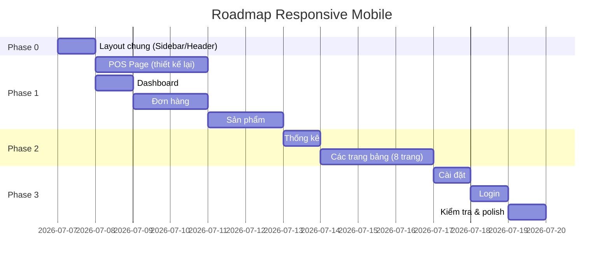

# 📱 Kế Hoạch Responsive Mobile — ChaoPizza POS

> **Mục tiêu**: Bổ sung responsive cho toàn bộ hệ thống để sử dụng tốt trên điện thoại (≤ 640px) và tablet (641px – 1024px), không bị vỡ layout.

---

## Tổng Quan Dự Án

| Thông tin | Chi tiết |
|---|---|
| Tổng số trang | 16 trang |
| Layout chung | Sidebar (trái) + Header (trên) + Nội dung (phải) |
| Sidebar mobile | ✅ Đã có sẵn (Sheet off-canvas, ẩn trên mobile) |
| Breakpoint chính | `sm: 640px` · `md: 768px` · `lg: 1024px` · `xl: 1280px` |

---

## Bảng Tổng Hợp Tất Cả Trang

| # | Trang | Vấn đề chính | Độ khó | Ưu tiên |
|---|---|---|---|---|
| 1 | **Layout (Sidebar + Header)** | Sidebar đã responsive ✅, Header cần kiểm tra breadcrumb | 🟢 Thấp | P0 |
| 2 | **Login** | Gần như đã responsive | 🟢 Thấp | P3 |
| 3 | **POS (Chọn món)** | Layout 2 cột cứng, giỏ hàng 380px, cần thiết kế lại hoàn toàn | 🔴 Cao | P0 |
| 4 | **Dashboard** | Grid 2 cột xl, bảng đơn hàng gần đây 7 cột, dialog đóng ca có bảng | 🟡 TB | P1 |
| 5 | **Đơn hàng** | Bảng 8 cột, bộ lọc phức tạp, dialog chi tiết đơn | 🔴 Cao | P1 |
| 6 | **Thống kê** | Biểu đồ cột & tròn trong grid 2 cột, thẻ tóm tắt grid-cols-3 | 🟡 TB | P2 |
| 7 | **Sản phẩm** | Bảng 7 cột, dialog tạo sản phẩm phức tạp (biến thể, ảnh) | 🔴 Cao | P1 |
| 8 | **Danh mục** | Bảng 6 cột | 🟡 TB | P2 |
| 9 | **Topping** | Bảng 5 cột | 🟢 Thấp | P3 |
| 10 | **Kích cỡ** | Bảng 4 cột | 🟢 Thấp | P3 |
| 11 | **Chấm công** | Thẻ thống kê + bảng 6 cột | 🟡 TB | P2 |
| 12 | **Chi tiết chấm công** | Thẻ tóm tắt + bảng 7 cột | 🟡 TB | P2 |
| 13 | **Tồn kho** | Bộ lọc ngang + bảng 7 cột | 🟡 TB | P2 |
| 14 | **Chi phí** | Thẻ tóm tắt + bảng 6 cột | 🟡 TB | P2 |
| 15 | **Nhân viên** | Thẻ thống kê + bảng 7 cột | 🟡 TB | P2 |
| 16 | **Lịch sử ca** | Bộ lọc + bảng 7 cột | 🟡 TB | P2 |
| 17 | **Cài đặt** | Form grid-cols-3, ảnh QR | 🟢 Thấp | P3 |

---

## Chi Tiết Từng Trang

---

### 🔲 Phase 0 — Layout Chung (Ưu tiên: P0)

#### 1. Sidebar + AppLayout

| Hạng mục | Hiện tại | Cần làm |
|---|---|---|
| Sidebar desktop | Cố định bên trái | ✅ Giữ nguyên |
| Sidebar mobile | Sheet (drawer) qua `useMobile()` | ✅ Đã có sẵn |
| Header | `SidebarTrigger` + Breadcrumb | Kiểm tra breadcrumb có bị tràn không trên mobile |
| Nội dung chính | `SidebarInset` → full width khi sidebar ẩn | ✅ OK |

> **Kết luận**: Layout chung đã responsive khá tốt nhờ shadcn SidebarProvider. Chỉ cần kiểm tra & micro-adjust.

**📸 Screenshot cần chụp**: *Sidebar mở trên mobile (Sheet), Header trên mobile*

---

### 🔴 Phase 1 — Các Trang Phức Tạp Nhất (Ưu tiên: P0–P1)

#### 2. POS Page — Chọn Món 🔴

> **Đây là trang khó nhất**, cần thiết kế lại layout hoàn toàn cho mobile.

**Cấu trúc hiện tại:**
```
┌──────────────────────┬───────────────┐
│                      │               │
│   Danh sách món      │   Giỏ hàng    │
│   (flex-1)           │   (w-380px)   │
│                      │               │
└──────────────────────┴───────────────┘
```

**Vấn đề:**
- Layout 2 cột cứng (`flex` với sidebar giỏ hàng `w-[380px]`)
- Trên mobile 375px, giỏ hàng chiếm hết màn hình
- Product grid, category tabs, search bar đều cần điều chỉnh
- Payment dialog & Customization dialog cũng cần xem lại

**Giải pháp đề xuất cho mobile:**
```
┌──────────────────────┐
│   Header + Search    │
├──────────────────────┤
│   Category tabs      │
│   (cuộn ngang)       │
├──────────────────────┤
│                      │
│   Danh sách món      │
│   (grid 2 cột)      │
│                      │
├──────────────────────┤
│  🛒 Nút Giỏ hàng    │  ← Floating button (badge số lượng)
│  (bottom sticky)     │
└──────────────────────┘

Nhấn nút → Giỏ hàng mở dạng Bottom Sheet / Full-screen overlay
```

**Chi tiết thay đổi:**

| Thành phần | Desktop (giữ nguyên) | Mobile (thay đổi) |
|---|---|---|
| Layout chính | 2 cột flex | 1 cột, full width |
| Giỏ hàng | Sidebar phải cố định | Bottom sheet / Overlay toàn màn hình |
| Nút giỏ hàng | Không cần (luôn hiện) | Floating button góc dưới phải, badge số lượng |
| Product grid | `grid-cols-4` | `grid-cols-2` |
| Category tabs | Hàng ngang | Cuộn ngang (đã có `overflow-x-auto`) |
| Search bar | `w-[320px]` cố định | `w-full` |
| Payment dialog | OK | Kiểm tra `grid-cols-2` phương thức thanh toán |
| Customization dialog | OK | Kiểm tra topping list layout |

**📸 Screenshots cần chụp**: *Danh sách món mobile, Giỏ hàng dạng sheet, Chọn topping, Dialog thanh toán*

---

#### 3. Dashboard 🟡

**Cấu trúc hiện tại:**
```
┌───────────────────────────┬──────────────┐
│   Ca làm việc (Card)      │  Quick       │
│                           │  Actions     │
├───────────────────────────┴──────────────┤
│   Thống kê nhanh (4 cột)                │
├──────────────────────────────────────────┤
│   Đơn hàng gần đây (Table 7 cột)        │
└──────────────────────────────────────────┘
```

| Thành phần | Hiện tại | Cần sửa cho mobile |
|---|---|---|
| Grid chính | `xl:grid-cols-[2fr_0.9fr]` | ✅ Đã stack trên < xl |
| Thẻ thống kê | `grid-cols-2 md:grid-cols-4` | ✅ Đã có fallback 2 cột |
| Bảng đơn gần đây | 7 cột, `overflow-x-auto` | Ẩn bớt cột (STT, Trạng thái thanh toán) hoặc cuộn ngang |
| Dialog đóng ca | Bảng tồn kho bên trong | Cuộn ngang cho bảng |
| Nút hành động | Grid trong Card | Stack dọc trên mobile |

**📸 Screenshots cần chụp**: *Dashboard mobile, Dialog mở ca, Dialog đóng ca*

---

#### 4. Đơn Hàng (OrderHistoryPage) 🔴

**Vấn đề chính:** Bảng 8 cột + bộ lọc phức tạp

| Thành phần | Hiện tại | Cần sửa cho mobile |
|---|---|---|
| Bộ lọc trạng thái | `grid-cols-2 xl:grid-cols-4` | ✅ Đã có fallback |
| Bộ lọc ngày | `md:flex-row` | ✅ Đã stack trên < md |
| Bảng đơn hàng | 8 cột cố định | **Chuyển sang dạng Card list** hoặc ẩn bớt cột (STT, phương thức TT) |
| Phân trang | Flex row | Thu gọn, ẩn text "Trang X/Y" |
| Dialog chi tiết đơn | Bảng items bên trong | Cuộn ngang hoặc stack |

**Giải pháp bảng trên mobile** (áp dụng cho nhiều trang):

> **Phương án A — Card List**: Trên mobile, mỗi đơn hàng thành 1 card nhỏ thay vì 1 hàng bảng
> ```
> ┌─────────────────────────┐
> │ #12  •  Nguyễn Văn A    │
> │ 150.000đ  •  Tiền mặt   │
> │ 14:30 01/07  •  ✅ Xong  │
> └─────────────────────────┘
> ```

> **Phương án B — Cuộn ngang**: Giữ nguyên bảng, bọc trong `overflow-x-auto` (đã có), nhưng thêm chỉ dẫn cuộn

**📸 Screenshots cần chụp**: *Danh sách đơn hàng mobile, Bộ lọc mobile, Dialog chi tiết đơn*

---

#### 5. Sản Phẩm (ProductManagementPage) 🔴

| Thành phần | Hiện tại | Cần sửa cho mobile |
|---|---|---|
| Bảng sản phẩm | 7 cột (có ảnh) | Ẩn cột STT, thu gọn cột biến thể, hoặc chuyển Card list |
| Dialog tạo/sửa | Form + bảng biến thể + upload ảnh | Stack form fields, bảng biến thể cuộn ngang |
| Nút thao tác | Inline trong bảng | Dropdown menu `...` |

**📸 Screenshots cần chụp**: *Danh sách sản phẩm mobile, Dialog thêm/sửa sản phẩm*

---

### 🟡 Phase 2 — Các Trang Trung Bình (Ưu tiên: P2)

> Các trang này có cấu trúc tương tự nhau: **Header + Table**. Áp dụng chung 1 pattern responsive.

#### 6. Thống Kê (AnalyticsPage) 🟡

| Thành phần | Hiện tại | Cần sửa cho mobile |
|---|---|---|
| Grid biểu đồ | `xl:grid-cols-2` | ✅ Đã stack trên < xl |
| Biểu đồ cột doanh thu | Thanh `min-w-14` cố định | Cuộn ngang nếu nhiều thanh |
| Biểu đồ tròn | SVG 220x220 | ✅ OK, vừa mobile |
| Biểu đồ giờ | `md:grid-cols-2` | ✅ Đã stack trên < md |
| Bộ lọc ngày | Flex row | Stack dọc trên mobile |

**📸 Screenshots cần chụp**: *Trang thống kê mobile, Biểu đồ doanh thu, Biểu đồ thanh toán*

---

#### 7–10. Danh mục / Topping / Kích cỡ / Chấm công / Chi tiết chấm công / Tồn kho / Chi phí / Nhân viên / Lịch sử ca

> **Pattern chung cho tất cả trang có bảng:**

| Thành phần | Cần làm |
|---|---|
| Header (tiêu đề + nút thêm) | `flex-wrap`, nút xuống hàng dưới trên mobile |
| Bảng ≤ 5 cột | Giữ nguyên + `overflow-x-auto` (đã có) |
| Bảng > 5 cột | Ẩn bớt cột ít quan trọng (STT, Mô tả) bằng `hidden sm:table-cell` |
| Bộ lọc (nếu có) | Stack dọc, full-width inputs |
| Thẻ thống kê (nếu có) | `grid-cols-2` trên mobile (đã có ở một số trang) |
| Dialog form | Đảm bảo form inputs full-width, không bị overflow |
| Pagination | Thu gọn, ẩn text dài |

**Bảng chi tiết từng trang:**

| Trang | Số cột | Cột ẩn trên mobile | Ghi chú |
|---|---|---|---|
| Danh mục | 6 | STT, Mô tả | |
| Topping | 5 | STT | |
| Kích cỡ | 4 | Không cần ẩn | Đơn giản nhất |
| Chấm công | 6 | STT | Stat cards đã responsive |
| Chi tiết CC | 7 | STT, Ghi chú | |
| Tồn kho | 7 | STT, Đơn vị | Bộ lọc cần stack |
| Chi phí | 6 | STT | Stat cards `sm:grid-cols-3` → cần thêm mobile |
| Nhân viên | 7 | STT, Username | Stat cards đã responsive |
| Lịch sử ca | 7 | STT, Người mở | Bộ lọc cần kiểm tra |

**📸 Screenshots cần chụp**: *Mỗi trang 1 ảnh giao diện mobile*

---

### 🟢 Phase 3 — Các Trang Đơn Giản (Ưu tiên: P3)

#### 11. Cài Đặt (SettingsPage) 🟢

| Thành phần | Hiện tại | Cần sửa cho mobile |
|---|---|---|
| Container | `max-w-2xl` centered | ✅ OK |
| Form ngân hàng | `grid-cols-3` | → `grid-cols-1` trên mobile |
| Ảnh QR | Inline | ✅ OK |
| Nút lưu | Footer | ✅ OK |

**📸 Screenshots cần chụp**: *Trang cài đặt mobile*

---

#### 12. Login 🟢

| Thành phần | Hiện tại | Cần sửa cho mobile |
|---|---|---|
| Card | `max-w-md`, centered | ✅ Đã responsive |
| Form | Stack dọc | ✅ OK |

**📸 Screenshots cần chụp**: *Trang đăng nhập mobile*

---

## Chiến Lược Chung Cho Bảng (Table)

Vì hầu hết các trang đều dùng bảng, đây là chiến lược thống nhất:

### Phương án được chọn: **Hybrid (Ẩn cột + Cuộn ngang)**

```
Mobile (< 640px):
- Ẩn các cột ít quan trọng bằng class `hidden sm:table-cell`
- Giữ cột quan trọng (Tên, Trạng thái, Thao tác)
- Nếu vẫn tràn → `overflow-x-auto` cho cuộn ngang

Tablet (640px – 1024px):
- Hiện thêm 1-2 cột
- Layout bảng gần giống desktop
```

---

## Thứ Tự Thực Hiện (Roadmap)



---

##  Checklist Tổng Hợp

- [x] **Phase 0**: Layout chung
  - [x] Kiểm tra Header/Breadcrumb trên mobile
  - [x] Test Sidebar Sheet hoạt động đúng
- [ ] **Phase 1**: Trang phức tạp
  - [x] POS — Redesign mobile layout (giỏ hàng → bottom sheet)
  - [x] POS — Floating cart button
  - [x] POS — Payment dialog responsive
  - [x] Dashboard — Bảng đơn gần đây responsive
  - [x] Dashboard — Dialog đóng ca responsive
  - [x] Đơn hàng — Bảng 8 cột → ẩn cột / card list
  - [x] Đơn hàng — Bộ lọc responsive
  - [x] Đơn hàng — Dialog chi tiết responsive
  - [x] Sản phẩm — Bảng 7 cột responsive
  - [x] Sản phẩm — Dialog tạo/sửa responsive
- [ ] **Phase 2**: Trang trung bình
  - [x] Thống kê — Biểu đồ & bộ lọc
  - [x] Danh mục — Bảng responsive
  - [x] Topping — Bảng responsive
  - [x] Kích cỡ — Bảng responsive
  - [ ] Chấm công — Bảng + stat cards
  - [ ] Chi tiết chấm công — Bảng responsive
  - [ ] Tồn kho — Bảng + bộ lọc
  - [ ] Chi phí — Bảng + stat cards
  - [ ] Nhân viên — Bảng + stat cards
  - [ ] Lịch sử ca — Bảng + bộ lọc
- [ ] **Phase 3**: Trang đơn giản
  - [ ] Cài đặt — `grid-cols-3` → stack
  - [ ] Login — Kiểm tra
  - [ ] Test toàn bộ trên Chrome DevTools (iPhone SE, iPhone 14, iPad)

---

## Open Questions

> [!IMPORTANT]
> **Câu hỏi cho bạn trước khi bắt tay vào code:**

1. **Trang POS (Chọn món)**: Bạn muốn giỏ hàng trên mobile hiện dạng nào?
   - **A)** Bottom Sheet (kéo lên từ dưới, giống Grab/ShopeeFood)
   - **B)** Full-screen overlay (nhấn nút → chuyển sang màn hình giỏ hàng riêng)
   
2. **Bảng dữ liệu trên mobile**: Bạn thích cách nào?
   - **A)** Ẩn bớt cột ít quan trọng, giữ bảng
   - **B)** Chuyển thành danh sách Card (mỗi dòng = 1 card)
   - **C)** Giữ nguyên bảng, cho cuộn ngang

3. **Mức độ ưu tiên**: Bạn muốn làm tất cả 1 lượt hay ưu tiên POS + Dashboard trước (vì nhân viên bán hàng hay dùng điện thoại nhất)?
